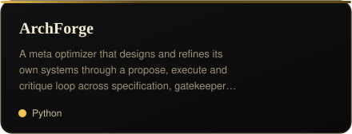
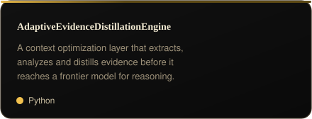
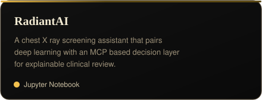
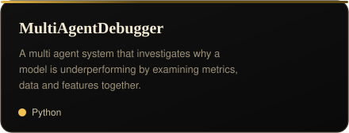
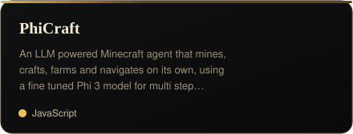

  

 

I like building AI and machine learning projects that solve real problems and help me learn by doing.
Currently exploring agentic AI, automation and open source while constantly trying to build something better.

 

## Projects worth a closer look

A few things I've built that say more about how I think:

 

  

  

  

  

 

## Things I work with

Languages, frameworks and tools that show up across my repositories and day to day work.

 

<b>Languages</b>
  

  

<b>AI &amp; ML Frameworks</b>
  

  

<b>Data Science &amp; Visualization</b>
  

  

<b>Web &amp; Application Frameworks</b>
  

  

<b>DevOps &amp; Tools</b>
  

 

## Contribution graph

I care more about steady progress, and this graph is usually a fair reflection of that.

 

Thanks for reading this far. If any of this overlaps with something you're working on, feel free to reach out.

  

